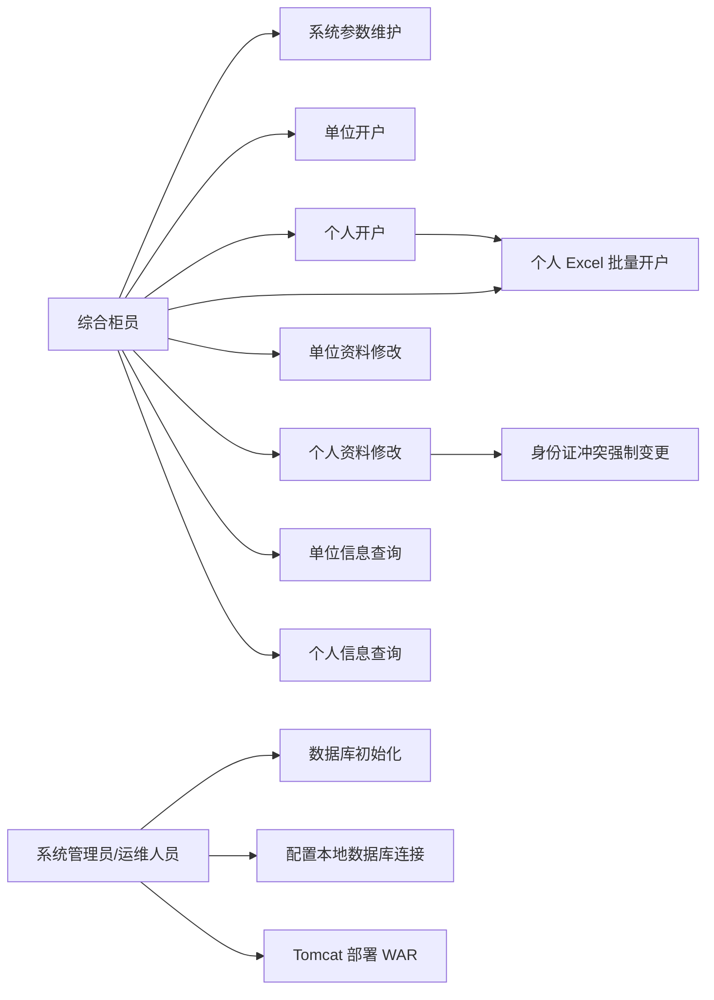
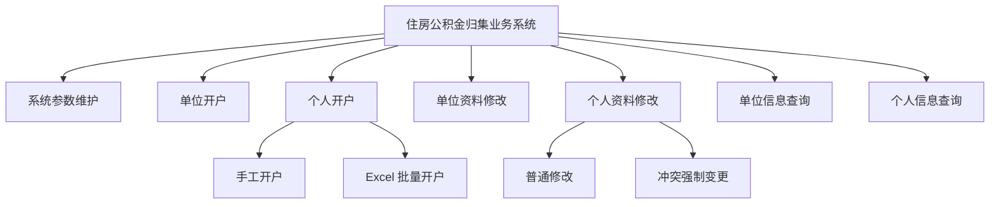
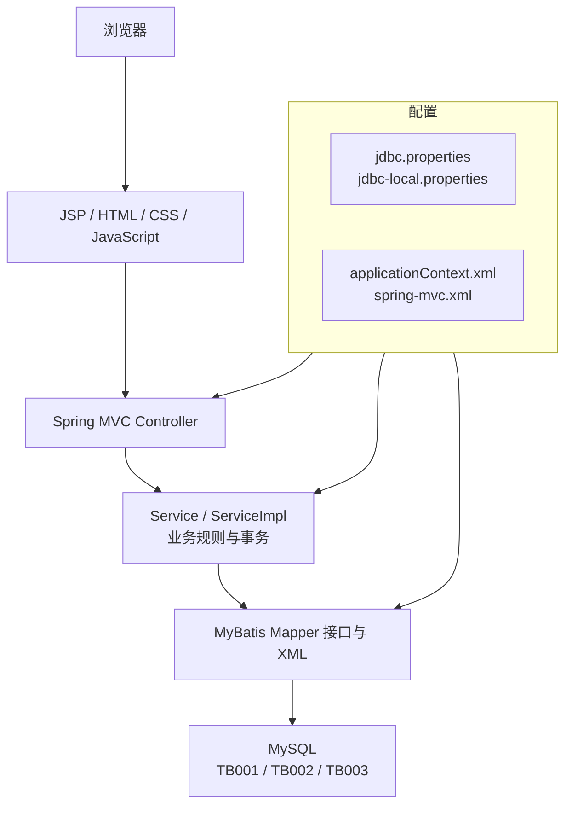
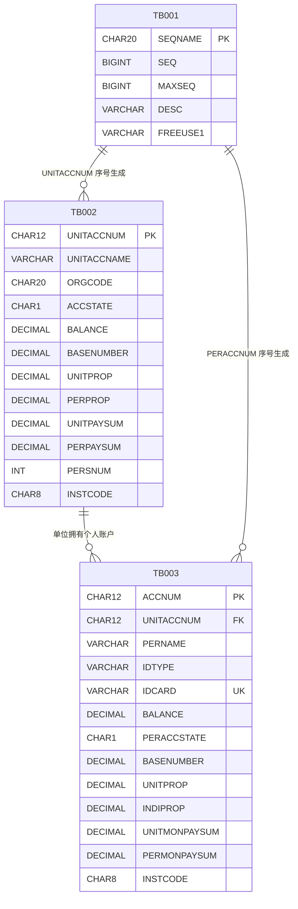
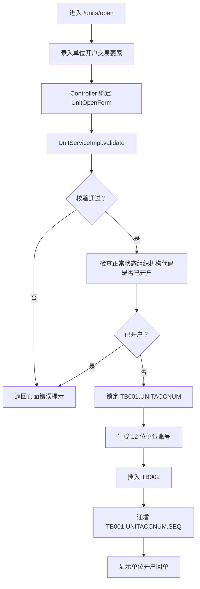
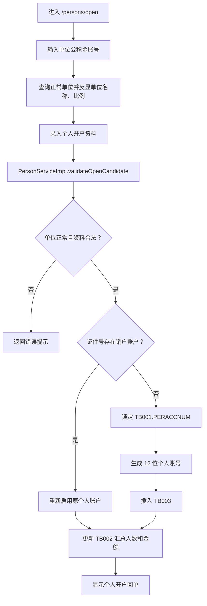
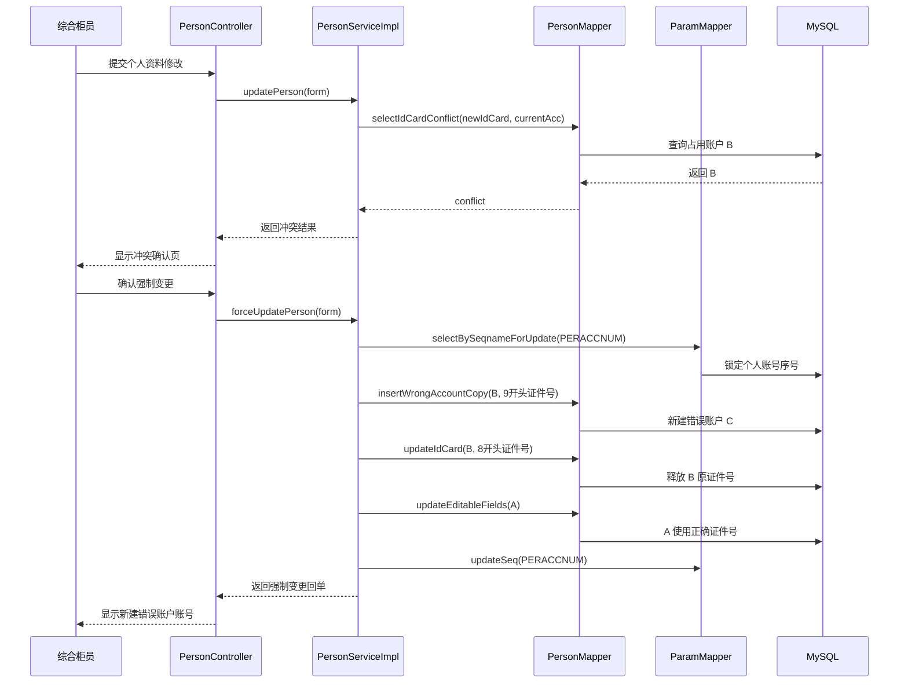
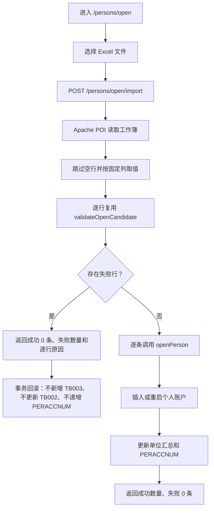
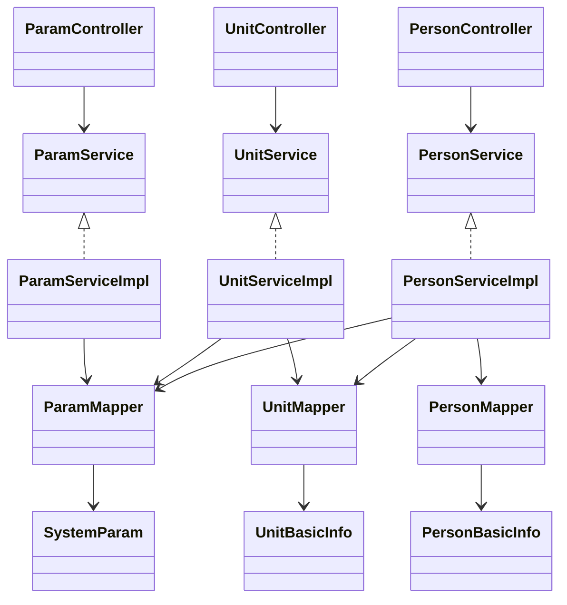

# 报告图表源码

本文件提供可复制到 Mermaid 渲染工具或 Markdown 编辑器中的图源码。图名与当前项目模块、包结构和数据库表保持一致。

## 1. 系统用例图

## 2. 功能层次图

## 3. 系统架构图

## 4. 数据库 ER 图

## 5. 单位开户流程图

## 6. 个人开户流程图

## 7. 个人资料强制变更时序图

## 8. Excel 批量开户流程图

## 9. 核心类与分层结构图

